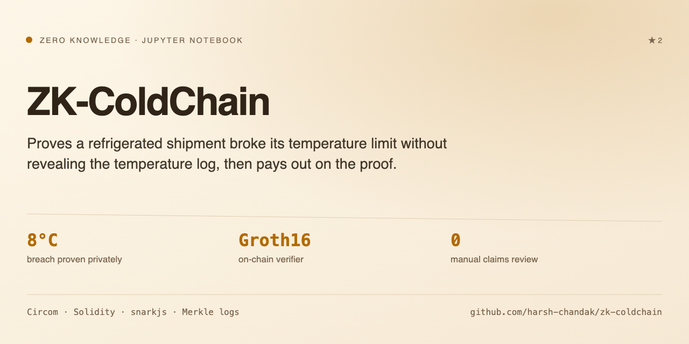

<picture>
  <source media="(prefers-color-scheme: dark)" srcset="assets/card-dark.png">
  <source media="(prefers-color-scheme: light)" srcset="assets/card-light.png">
  
</picture>

# ZK-ColdChain: Private Compliance Proofs with Parametric Payouts

A refrigerated shipment either stayed cold or it did not, and the insurer needs
to know which. Handing over the temperature log answers that, and also tells the
insurer the route, the dwell times and how the shipper runs their operation.

ZK-ColdChain proves the breach without the log. A Circom circuit takes the
private readings and outputs one bit, breach or no breach, plus a commitment to
the data it read. `Insurance.sol` pays out on a valid proof of that bit. The
readings never leave the client.

The payout is parametric, so there is no claim to file and nothing to dispute:
the proof that triggers the payment is the same proof that establishes the
breach.

**Course:** CSE 540, Engineering Blockchain Applications (Fall 2025) ·
**Team:** Group 24 · **University:** Arizona State University

---

## 🏗️ System Architecture

The system is composed of four distinct layers working in unison:

1.  **The Smart Contract Layer (Solidity):**
    * **`SupplyChain.sol`**: Acts as the "Source of Truth" for shipment status and custody. It stores the **Merkle Root** of the temperature logs, making the data immutable once the shipment arrives.
    * **`Insurance.sol`**: A parametric insurance vault. It holds the shipper's deposit and releases it to the buyer *only* upon receiving a valid ZK Proof of breach.
    * **`Verifier.sol`**: A mathematically generated contract that validates the ZK Proof on-chain.

2.  **The Privacy Layer (Circom & SnarkJS):**
    * A custom arithmetic circuit (`temperature.circom`) that takes private temperature readings as input and outputs a boolean flag (Breach/No Breach) and a cryptographic commitment (Hash). This ensures the raw data never leaves the client's device.

3.  **The Gateway Layer (Node.js / In-Browser):**
    * Simulates an IoT Gateway that aggregates sensor readings, calculates the Poseidon Hash (Merkle Root), and "Seals" the shipment on the blockchain.

4.  **The Application Layer (React/Vite):**
    * A "God Mode" Dashboard that allows users to simulate all stakeholders (Manufacturer, Shipper, Gateway, Buyer) from a single interface for demonstration purposes.

---

## 📂 Project Structure

```text
CSE540-Supplychain/
├── circuits/          # Zero-Knowledge Logic
│   ├── temperature.circom   # The constraint logic (Max Temp = 8°C)
│   └── generate_proof.js    # Script for offline proof generation
├── contracts/         # Solidity Smart Contracts
│   ├── SupplyChain.sol      # Logic for product registration & sealing
│   ├── Insurance.sol        # Logic for deposits & payouts
│   └── Verifier.sol         # Auto-generated ZK verifier
├── frontend/          # React User Interface ("God Mode" Dashboard)
│   ├── public/              # Contains .wasm and .zkey files (The "Keys")
│   └── src/App.jsx          # Main application logic
└── gateway/           # Backend Simulation
    └── gateway.js           # Node.js script for automated sealing
```

---

## 🛠️ Prerequisites

To run this project locally, you need:

- **Node.js** (v16 or higher)
- **MetaMask** (Browser Extension) configured for Sepolia Testnet.
- **Sepolia ETH** (Testnet currency) for gas fees.

---

## 🚀 Installation & Setup Guide

### Phase 1: Smart Contract Deployment

*We use Remix IDE to deploy the contracts to the Sepolia Testnet.*

1. Open [Remix IDE](https://remix.ethereum.org/).
2. Copy the files from the `contracts/` folder into Remix.
3. **Compile** all three contracts (`SupplyChain.sol`, `Insurance.sol`, `Verifier.sol`).
4. Deploy in this specific order:
   - Step A: Deploy `SupplyChain.sol`. -> *Copy Address*.
   - Step B: Deploy `Verifier.sol` (Groth16Verifier). -> *Copy Address*.
   - Step C: Deploy `Insurance.sol`.
     - Constructor Args: Pass the addresses from Step A and Step B.
     - Copy Address.

### Phase 2: Frontend Configuration

1. Navigate to the frontend directory:
   
   ```
   cd frontend
   ```
   
3. Install dependencies:
   
   ```
   npm install
   ```
   
5. Open `src/App.jsx` and update the configuration constants at the top:
   
   ```
   const INSURANCE_ADDRESS = "YOUR_DEPLOYED_INSURANCE_ADDRESS";
   const SUPPLY_CHAIN_ADDRESS = "YOUR_DEPLOYED_SUPPLY_CHAIN_ADDRESS";
   ```

### Phase 3: Running the Dashboard

Start the local development server:
```
npm run dev
```

Open your browser to [`http://localhost:5173`](http://localhost:5173).

---

## User Manual (Demo Flow)

The Dashboard is divided into 4 tabs representing the lifecycle of a shipment.

**Tab 1: Manufacturer (Registration)**
- **Goal**: Create a digital twin for the physical goods.
- **Action**: Enter a SKU name (e.g., "Vaccine-Batch-X") and click Register.
- **Outcome**: A new Product ID is generated on the blockchain.

**Tab 2: Shipper (Insurance)**
- **Goal**: Secure the shipment with financial collateral.
- **Action**: Enter the Product ID and click **Pay Deposit**.
- **Outcome**: 0.001 ETH is deducted from your wallet and locked in the Insurance Smart Contract.

**Tab 3: Gateway (The Journey)**
- **Goal**: Simulate the transportation and data logging.
- **Context**: The default simulated data is `7, 6, 8, 10, 7`. The reading `10` violates the max temperature rule of `8`.
- **Action**: Click **Calculate Root & Seal**.
- **Outcome**: The application calculates the ZK-friendly Poseidon Hash of the readings in the browser and commits it to the `SupplyChain` contract, making the timeline immutable.

**Tab 4: Buyer (Claim)**
- **Goal**: Verify compliance trustlessly and claim payout.
- **Action 1**: Click **Check Status** to see the locked funds.
- **Action 2**: Click **Generate Proof & Claim Payout**.
- **Outcome**:
  - The browser generates a ZK Proof proving the value `10` exists in the sealed log.
  - The proof is sent to the smart contract.
  - The contract verifies the proof and instantly transfers the deposit to the Buyer.
 
---

## 👥 Team Roles & Contributors

- **Soham Sachin Joshi (Product & PM)**: Scope definition, documentation, and demo orchestration.
- **Harsh Nitinkumar Chandak (Frontend & DevOps)**: React dashboard implementation, Web3 integration, and repository management.
- **Kartik Suhas Marathe (ZK & Backend Lead)**: Circuit design (`temperature.circom`), Merkle tree logic, and gateway automation.
- **Aman Bhaiji Jain (Smart-Contract Lead)**: Design and implementation of `Insurance.sol` and escrow logic.
